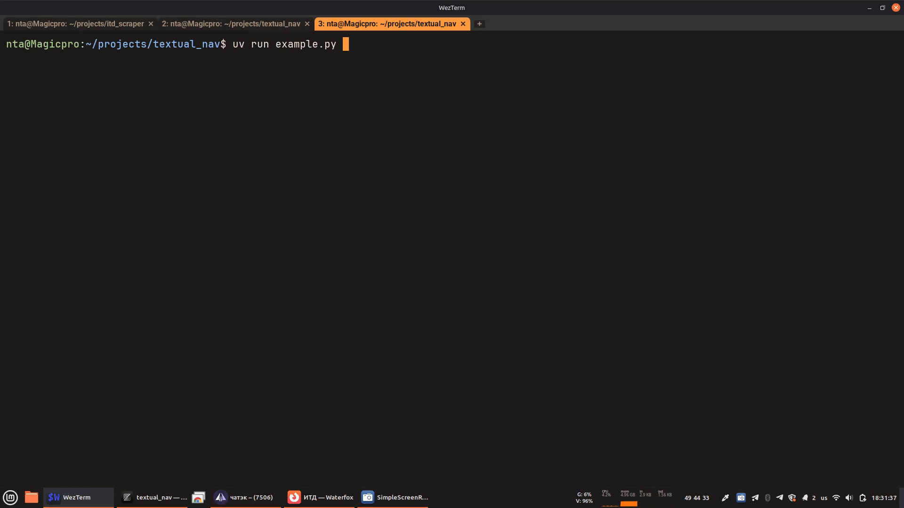
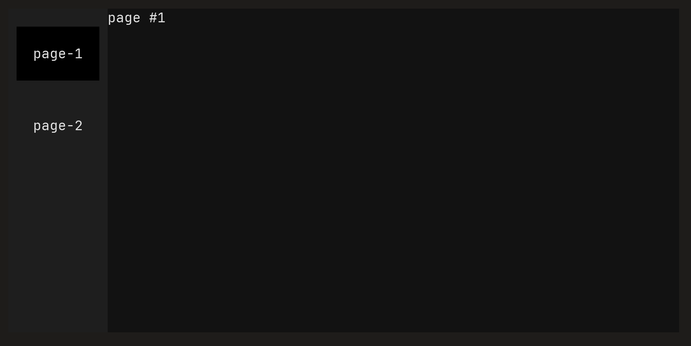
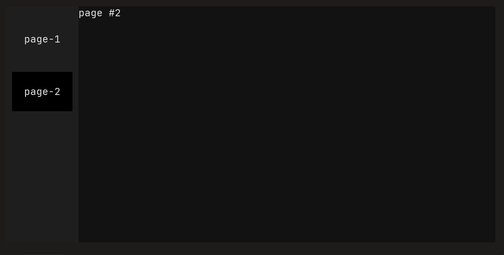
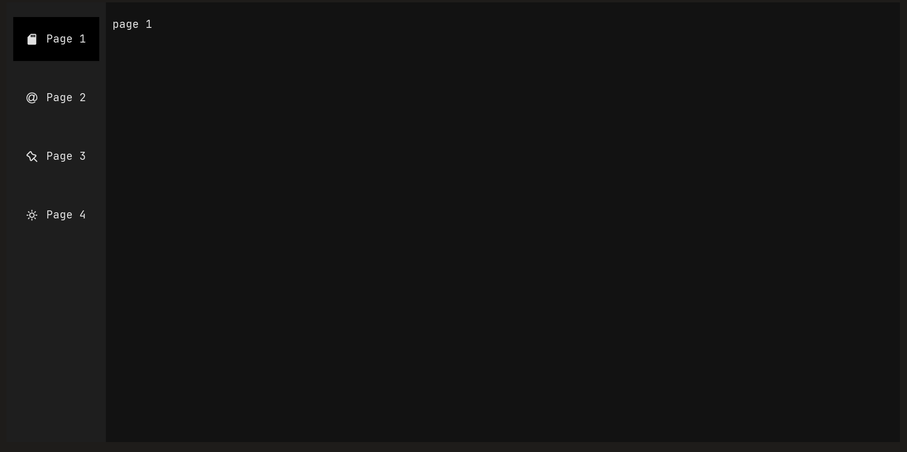
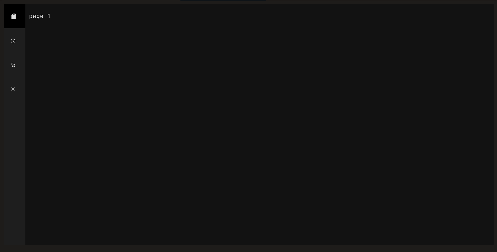
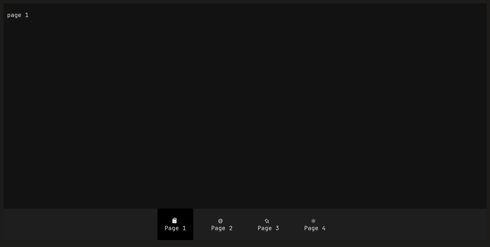

# textual_nav

Add navigation bars to your textual app easily.



## Example
```py
from textual.widgets import Static, Button
from textual_nav import NavApp, NavPage, NavigationDrawer

class Page1(NavPage, tab_name='page-1'):
    def compose(self):
        yield Static('page #1')

class Page2(NavPage, tab_name='page-2'):
    def compose(self):
        yield Static('page #2')

class MyApp(NavApp):
    PAGES = [Page1(), Page2()]
    NAV_TYPE = NavigationDrawer

MyApp().run()
```
  | 
---|---

## Installation
```bash
uv add git+https://github.com/fi-res/textual_nav
```
> PyPI release soon

## API
### NavApp
Base app class.

#### Attributes
 - `NAV_POSITION` (literal `left` | `right` | `top` | `bottom`): Position for navigation bar. Defaults to `left`.
 - `NAV_TYPE` (type of `BaseNavigationWidget`): Type of navigation container. Can be `NavigationDrawer`, `NavigationRail`, `NavigationBar` or any other custom class inherited from `BaseNavigationWidget`.

 NavigationDrawer | NavigationRail | NavigationBar
-------------------|----------------|----------------
 |  | 

 - `PAGES` (list of instances of `NavPage`): List of pages to show. Required.
 - `DEFAULT_PAGE` (instance of `NavPage`): Default page to be opened on app startup. If not passed, first page from `PAGES` will be used.
 - `nav_visible` (reactive - bool): Is navigation bar visible. Defaults to `true`.

#### Methods
 - `compose_nav`: Compose navigation bar. Required to override if `NAV_TYPE` not passed.
 - `push_screen`: Push new subpage on top of current stack.
 - `pop_screen`: Pop most top subpage in the stack. If there is only one page in the stack, exception will be throwen.
 - `switch_screen`: Switch current page to another one. Stack of subpages will be cleaned.

 > [!NOTE]
 > Please do not override `compose` method. Content will be composed from `compose_nav` and the most top page in the stack.

### NavPage
Base page class. When inheriting from this class, you can add `tab_name` and `tab_icon` to display it in navigation container:
```py
class MyPage(NavPage, tab_name='My new page', tab_icon='+'):
    ...
```

#### Methods
 - `pop` / `push` / `switch`: Aliases for app's `pop_screen`, `push_screen` and `switch_screen`.

### Customization
Navbar appearance can be configured in css:
```css
Tab {
    background: blue;
}
Tab.selected {
    background: red;
}
NavigationDrawer {
    padding: 2;
    backgorund: blue;
}
```
